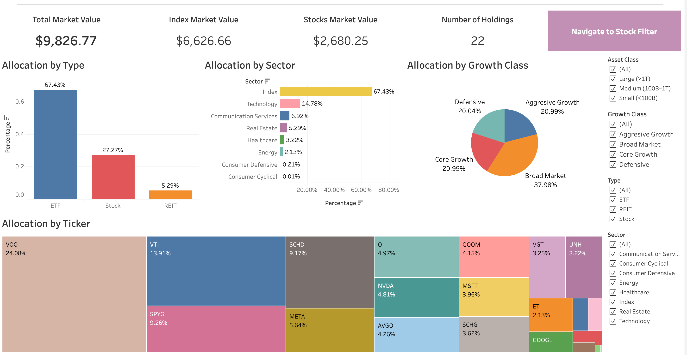
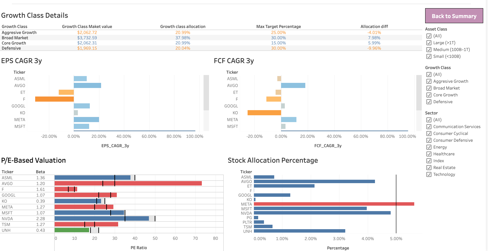

# Investment Analytics & Portfolio Management Dashboard

## About the Project

This project is a self-directed investment analytics system designed to support data-driven personal investing using business and financial analysis principles. The goal is to replicate institutional-style portfolio monitoring by combining automated data ingestion, fundamental analysis, and interactive visualization.

The system imports live market data and company fundamentals for both stocks and ETFs, including prices, valuation metrics (P/E), earnings and cash flow growth, market capitalization, beta, and expense ratios. Portfolio holdings are maintained externally in Excel to ensure separation of data and logic, enabling scalable and maintainable updates without code changes.

Using Python, the project automates data collection, metric calculation (market value, allocation percentages, EPS and FCF growth), and classification of assets by growth profile and type. The processed data is then visualized in Tableau dashboards that highlight portfolio allocation, valuation relative to fair ranges, contribution accumulation, and long-term earnings power—providing clear insights for disciplined investment decision-making.

This project demonstrates practical skills in Python, financial data engineering, business analytics, and data visualization, while showcasing a long-term, process-driven approach to investing.

## Note: 
All portfolio values, holdings, and figures shown in this project are sample or modified data and do not represent my actual investment portfolio.

## Link to the Tableau Dashboard 

https://public.tableau.com/app/profile/tharindu.abeysinghe/viz/InvestmentPortfolioMonitoringDashboard/OverallSummary

## Key Insights & Why They Matter

[]

1. Efficient filtering to narrow the investable universe

Interactive filters allow rapid narrowing of stocks based on type, sector, and key financial characteristics. This mirrors real-world analyst workflows, where screening is used to focus attention on the most relevant opportunities and diversification rather than reviewing every asset individually.

2. Supports “what to buy next” decisions

Because the dashboard does not rely on time-series performance, it emphasizes current fundamentals and valuation alignment. This makes it especially useful for forward-looking allocation decisions rather than retrospective performance tracking.

[]

3. Valuation context, not just valuation numbers

The dashboard places each stock’s current P/E ratio alongside a fair P/E range, helping distinguish between expensive, fairly valued, and potentially undervalued securities. This matters because absolute valuation metrics alone lack context—relative positioning improves comparability across companies and sectors.

4. Fundamental strength surfaced at the decision point

Earnings growth, cash flow indicators, and profitability metrics are presented alongside valuation, enabling a quick assessment of whether a company’s fundamentals support its current price. This reduces the risk of selecting stocks based solely on price-based signals.

## Tech Stack

- **Python**: Data ingestion, cleaning, and analysis (pandas, yfinance, custom financial metric functions)

- **Excel**: Portfolio inputs, holdings management, and structured data control

- **Tableau**: Interactive dashboards for allocation analysis, valuation monitoring, and performance tracking

- **Financial Data Sources**: Yahoo Finance (prices, fundamentals, financial statements)

- **Version Control**: Git & GitHub for code management and project documentation